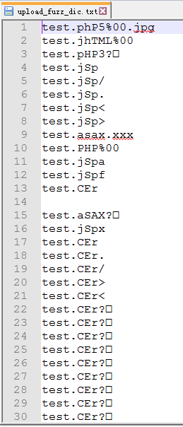
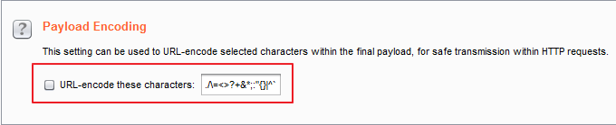

# upload-fuzz-dic-builder 上传漏洞fuzz字典生成脚本



## 一、uasg

```
$ python upload-fuzz-dic-builder.py -h
usage: upload-fuzz-dic-builder [-h] [-n] [-a] [-l] [-m] [--os] [-d] [-o]

optional arguments:
  -h, --help            show this help message and exit
  -n , --upload-filename
                        Upload file name
  -a , --allow-suffix   Allowable upload suffix
  -l , --language       Uploaded script language
  -m , --middleware     Middleware used in Web System
  --os                  Target operating system type
  -d, --double-suffix   Is it possible to generate double suffix?
  -o , --output         Output file
```

### 1.1 Example1
生成适合全语言，全部中间件，全部操作系统的fuzz字典

```
python upload-fuzz-dic-builder.py
```

### 1.2 Example2
生成适合后端语言为`asp`的fuzz字典

```
python upload-fuzz-dic-builder.py -l asp
```

### 1.3 Example3
上传文件名为：`test`，可以上传后缀为`jpg`，后端语言为`php`，中间件为`apache`，操作系统为`Windows`，输出字典名为`upload_filename.txt`的fuzz字典

```
python upload-fuzz-dic-builder.py -n test -a jpg -l php -m apache --os win -o upload_file.txt
```


### 1.4 注意：

1. 生成时给的上传点相关信息越详细，生成的字典越精确！
2. 在使用burp的Intruder模块进行fuzz时将Payload面板中`Payload Encoding`一栏的`URL-encode these characters`选项设置为未选中状态。



## 二、more

[构造优质上传漏洞fuzz字典](http://gv7.me/articles/2018/make-upload-vul-fuzz-dic/)